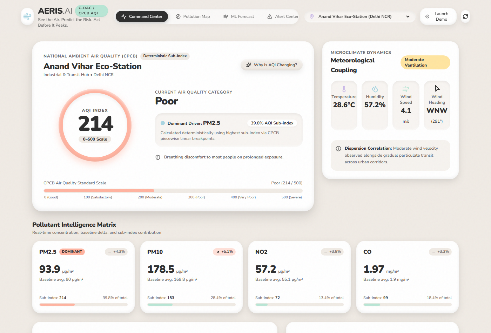
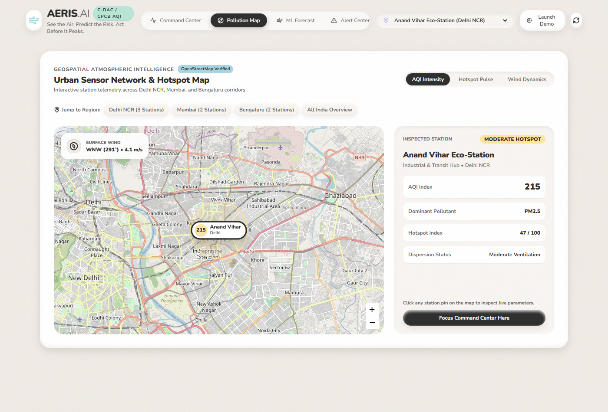
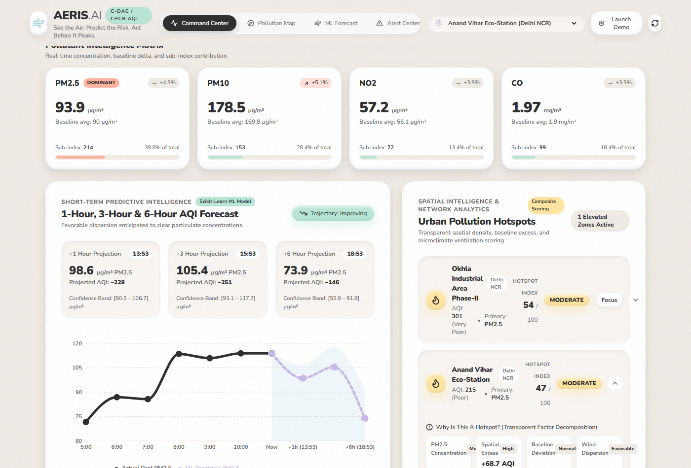
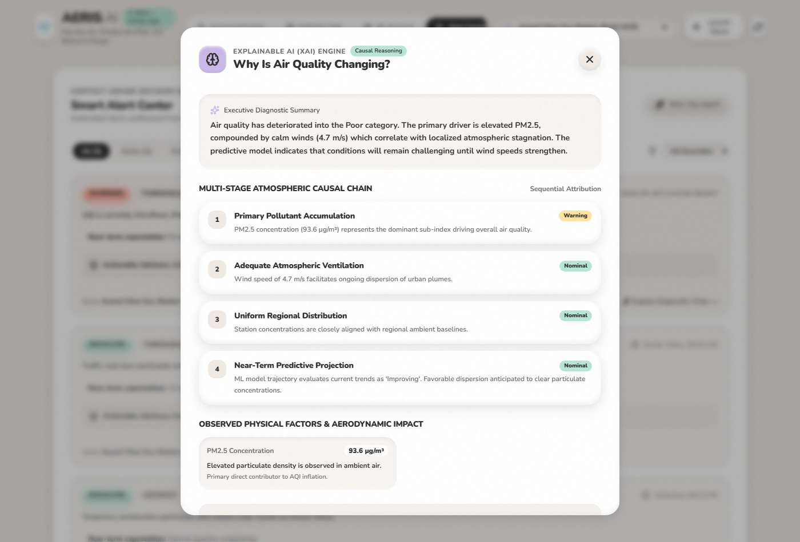
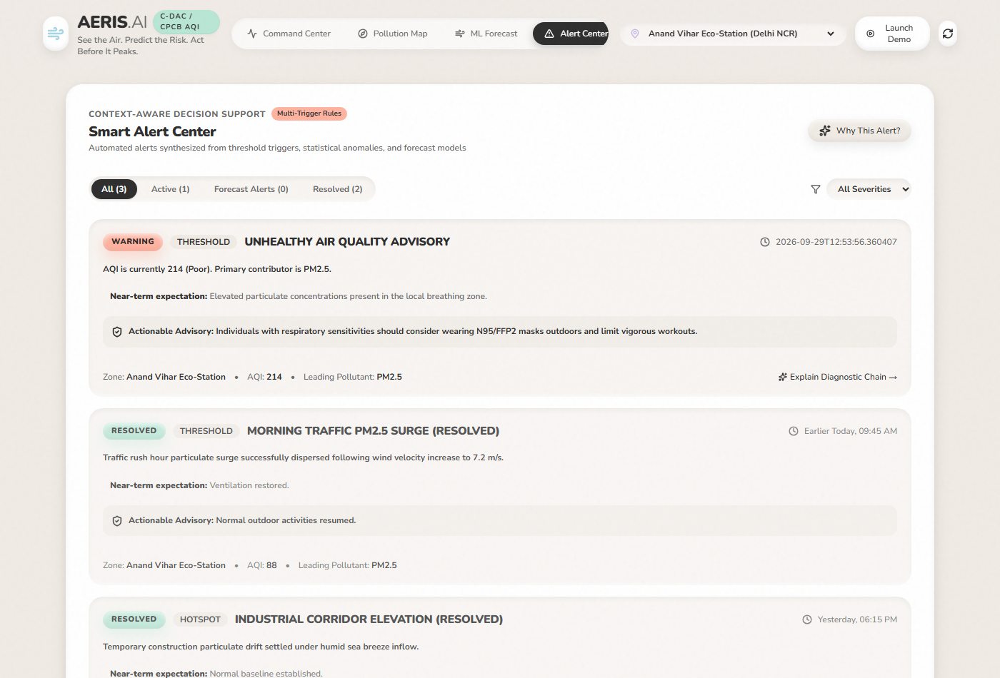
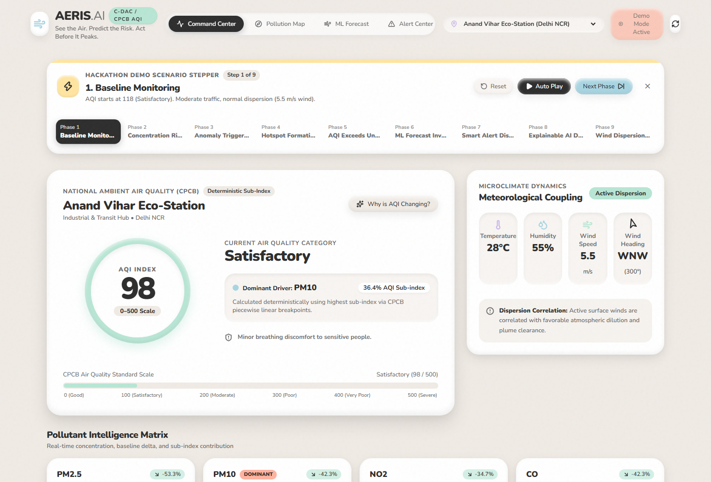
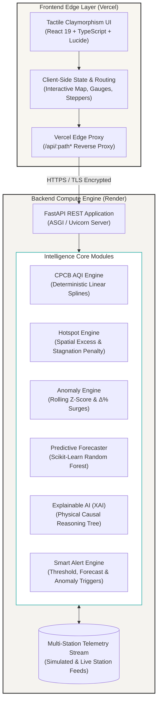
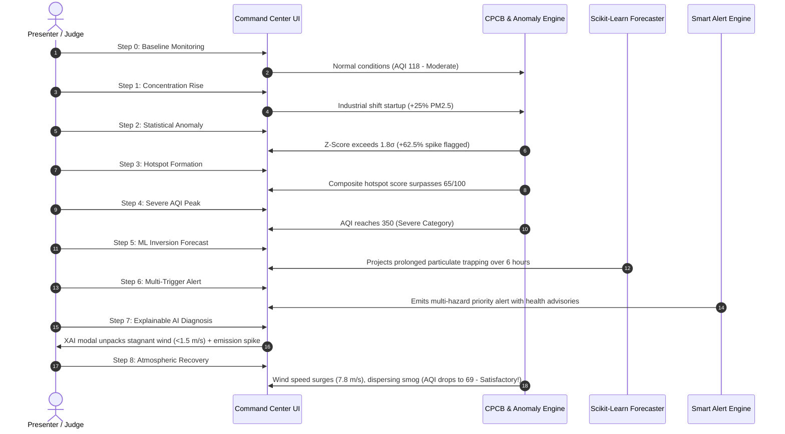

<div align="center">

# 🍃 AERIS AI
### AI-Powered Urban Air Intelligence & Pollution Alert System

> *"See the Air. Predict the Risk. Act Before It Peaks."*

<br/>

[](https://aeris-ai-jade.vercel.app/)
[](https://aeris-ai-1iu7.onrender.com/api/status)
[](https://aeris-ai-1iu7.onrender.com/docs)

<br/>

[](https://fastapi.tiangolo.com/)
[](https://react.dev/)
[](https://www.typescriptlang.org/)
[](https://scikit-learn.org/)
[](https://tailwindcss.com/)
[](LICENSE)

</div>

---

## 🌐 Live Deployments

| Component | Platform | Direct URL | Status |
| :--- | :--- | :--- | :--- |
| **Frontend Web Application** | **Vercel** | [https://aeris-ai-jade.vercel.app/](https://aeris-ai-jade.vercel.app/) |  |
| **Backend REST API** | **Render** | [https://aeris-ai-1iu7.onrender.com/](https://aeris-ai-1iu7.onrender.com/) |  |
| **Interactive Swagger Docs** | **Render** | [https://aeris-ai-1iu7.onrender.com/docs](https://aeris-ai-1iu7.onrender.com/docs) |  |
| **API Health Check** | **Render** | [https://aeris-ai-1iu7.onrender.com/api/status](https://aeris-ai-1iu7.onrender.com/api/status) |  |

---

## 📸 Application Showcase

<div align="center">
  
  <p><em>Real-Time Command Center: CPCB Deterministic Sub-Index AQI Dial, Meteorological Coupling & Ambient Pollutant Matrix</em></p>
</div>

<br/>

| **Spatial Intelligence & Map** | **Short-Term Predictive ML Forecaster** |
| :---: | :---: |
|  |  |
| *Leaflet Geospatial Map with Wind Vectors & Click-to-Pin* | *+1h, +3h, +6h Forecast Horizons with Scikit-Learn (R² = 0.892)* |

| **Explainable AI (XAI) Attribution** | **Multi-Trigger Smart Alert Dispatcher** |
| :---: | :---: |
|  |  |
| *Sequential Causal Trees & Meteorological Trap Diagnostics* | *Severity Filtering, Threshold Exceedances & Recovery Feeds* |

<div align="center">
  
  <p><em>Controlled 8-Step Hackathon Demonstration Stepper: Visualizing Full Smog Formation to Wind Influx Atmospheric Recovery</em></p>
</div>

---

## 🌟 Architecture & Intelligence Pipeline

### Real-Time Intelligence Lifecycle

```mermaid
flowchart LR
    A["📡 Ingest & Monitor<br/>(Multi-Station Telemetry)"] --> B["⚖️ CPCB Sub-Index Engine<br/>(Deterministic Piecewise Linear)"]
    B --> C["🔍 Anomaly & Hotspot Detector<br/>(Z-Score > 1.8σ & Spatial Density)"]
    C --> D["🔮 ML Forecaster<br/>(Random Forest Regressor)"]
    D --> E["🚨 Smart Alert Engine<br/>(Multi-Trigger Hazard Feeds)"]
    E --> F["🧠 Explainable AI (XAI)<br/>(Causal Chain Attribution)"]
    F --> G["🍃 Atmospheric Recovery<br/>(Wind Front Dispersion)"]

    style A fill:#A8D5E2,stroke:#2D2D2D,stroke-width:1.5px,color:#2D2D2D
    style B fill:#FFE5A0,stroke:#2D2D2D,stroke-width:1.5px,color:#2D2D2D
    style C fill:#FFB3A0,stroke:#2D2D2D,stroke-width:1.5px,color:#2D2D2D
    style D fill:#C9B8E8,stroke:#2D2D2D,stroke-width:1.5px,color:#2D2D2D
    style E fill:#D4A5A5,stroke:#2D2D2D,stroke-width:1.5px,color:#2D2D2D
    style F fill:#FFE5A0,stroke:#2D2D2D,stroke-width:1.5px,color:#2D2D2D
    style G fill:#B8E6D5,stroke:#2D2D2D,stroke-width:1.5px,color:#2D2D2D
```



### System & Cloud Deployment Topology



---

## 🚀 Key Modules & Capabilities

### 1. Deterministic Indian National AQI Engine (CPCB)
- Implements the official **Central Pollution Control Board (CPCB)** piecewise linear sub-index formula for criteria pollutants:
  - $\text{PM}_{2.5}$ (24-hour average)
  - $\text{PM}_{10}$ (24-hour average)
  - $\text{NO}_2$ (24-hour average)
  - $\text{CO}$ (8-hour average)
- Overall AQI calculated deterministically as $\max(I_{\text{PM2.5}}, I_{\text{PM10}}, I_{\text{NO2}}, I_{\text{CO}})$.
- Clear distinction between deterministic mathematical AQI calculation and predictive machine learning forecasts.

### 2. Spatial Pollution Hotspot Detection Engine
- Calculates transparent composite hotspot scores ($0\text{–}100$) combining:
  - **$\text{PM}_{2.5}$ Intensity Factor**: Scaled against the national ambient standard ($60\ \mu\text{g/m}^3$).
  - **Spatial Excess**: Deviation relative to regional network average.
  - **Baseline Deviation**: Difference against station's 24-hour rolling average.
  - **Microclimate Stagnation Penalty**: Triggered when wind speed falls below $2.0\text{ m/s}$ (inversion risk).
- Provides transparent factor decomposition: *"Why is this a hotspot?"*.

### 3. Statistical Anomaly Detection Engine
- Uses rolling statistical variance ($Z\text{-score} > 1.8\sigma$) and rate of change ($\Delta\% > 35\%$) to flag sudden localized surges (e.g., $+62.5\%$ particulate spike).
- Immediately displays diagnostic banners and warning feeds when anomalous accumulation is detected.

### 4. Short-Term ML AQI & Pollutant Forecaster
- Powered by a trained **Scikit-Learn Random Forest Regressor** using lagged multi-pollutant inputs, cyclic temporal features ($\sin/\cos$ hour & day), and atmospheric dispersion dynamics.
- Projects $+1\text{ hour}$, $+3\text{ hours}$, and $+6\text{ hours}$ horizons with confidence uncertainty bounds.
- **Genuine Test Evaluation Metrics:**
  - **MAE:** $\pm 4.38\ \mu\text{g/m}^3$
  - **RMSE:** $5.38\ \mu\text{g/m}^3$
  - **$R^2$ Score:** $0.892$

### 5. Explainable AI (XAI)
- Dedicated *"Why is AQI Changing?"* and *"Why this Alert?"* modal diagnostics.
- Deconstructs physical factors into multi-stage causal chains with scientifically responsible terminology (*"associated with"*, *"correlated with"*, *"observed alongside"*).

### 6. Interactive Geospatial Map (Leaflet)
- Custom tactile pastel markers with color-coded AQI badges and pulsing hotspot rings.
- Dynamic wind heading compass vector overlay.
- Real-time station telemetry inspector.
- **Interactive Pin Dropper**: Click anywhere on the map to pin a custom coordinate and calculate real-time environmental intelligence.

### 7. Manual Telemetry Injector (Test Lab)
- Dedicated testing panel to manually inject custom pollutant levels ($\text{PM}_{2.5}$, $\text{PM}_{10}$, $\text{NO}_2$, $\text{CO}$, Wind Speed, Humidity) and immediately observe how the deterministic AQI engine, ML forecaster, and smart alerts respond in real time.

---

## 🎬 8-Step Incident Lifecycle Demo

AERIS AI features a built-in presentation stepper simulating an entire urban pollution cycle from baseline to severe crisis and atmospheric recovery:



---

## 🎨 Visual Design System: Tactile Claymorphism

AERIS AI is built on a handcrafted **Tactile Claymorphism** design language:
- **Atmospheric Grain:** `#F0EBE5` warm off-white canvas with an ultra-subtle $2.5\%$ SVG fractal noise overlay.
- **Puffy Surfaces:** Zero harsh borders; cards defined by layered double-inset highlights and soft ambient drop shadows:
  ```css
  box-shadow:
    inset 0 -4px 8px rgba(0, 0, 0, 0.05),
    inset 0 4px 8px rgba(255, 255, 255, 0.9),
    0 8px 24px rgba(0, 0, 0, 0.08),
    0 4px 12px rgba(0, 0, 0, 0.04);
  border-radius: 24px;
  ```
- **Harmonious Status Palette:**
  - Good / Satisfactory: `#B8E6D5` (Soft Mint)
  - Moderate: `#FFE5A0` (Butter Yellow)
  - Unhealthy / Poor: `#FFB3A0` (Warm Coral)
  - Hazardous / Severe: `#D4A5A5` (Clay Crimson)
  - Data Blue & Purple: `#A8D5E2` & `#C9B8E8`
- **Typography:** Google Fonts *Nunito* and *Quicksand*.
- **Tactile Micro-Interactions:** Spring hover lift (`translateY(-4px)` with `cubic-bezier(0.34, 1.56, 0.64, 1)`).

---

## 🛠️ Repository Structure

```
AERIS-AI/
├── backend/
│   ├── app/
│   │   ├── engine/
│   │   │   ├── aqi_engine.py       # CPCB Deterministic AQI piecewise calculation
│   │   │   ├── hotspot_engine.py   # Spatial hotspot composite scoring
│   │   │   ├── anomaly_engine.py   # Statistical rolling Z-score & rate-of-change
│   │   │   ├── forecast_engine.py  # Scikit-Learn Random Forest forecaster
│   │   │   ├── alert_engine.py     # Multi-rule smart alert generator
│   │   │   ├── explain_engine.py   # Causal reasoning & XAI attribution trees
│   │   │   └── data_provider.py    # Multi-station data stream & demo scenario
│   │   └── main.py                 # FastAPI application & REST endpoints
│   ├── start.py                    # Production entrypoint with dynamic PORT binding
│   └── requirements.txt            # Backend dependencies (FastAPI, scikit-learn, etc.)
├── frontend/
│   ├── src/
│   │   ├── components/
│   │   │   ├── Navbar.tsx           # Navigation tabs, station picker & demo trigger
│   │   │   ├── DemoController.tsx   # 8-Step Hackathon Demo Scenario controller
│   │   │   ├── AQIHeroCard.tsx      # Inflated AQI gauge & health advisory
│   │   │   ├── PollutantGrid.tsx    # PM2.5, PM10, NO2, CO matrix & contributions
│   │   │   ├── WeatherCard.tsx      # Microclimate & aerodynamic dispersion analysis
│   │   │   ├── ForecastSection.tsx  # ML predictions, confidence bands & evaluation metrics
│   │   │   ├── HotspotsSection.tsx  # Ranked hotspots & factor decomposition
│   │   │   ├── AlertsSection.tsx    # Active, forecast & resolved alert feeds
│   │   │   ├── MapSection.tsx       # Leaflet interactive map with custom pins & click-to-pin
│   │   │   ├── HistoricalSection.tsx# 24-hour time-series area charts
│   │   │   ├── AnomalyBanner.tsx    # Prominent statistical anomaly notification
│   │   │   ├── ExplainableAIModal.tsx# Sequential causal diagnostic tree modal
│   │   │   └── ManualTestPanel.tsx  # Live parameter injector & simulation sandbox
│   │   ├── services/
│   │   │   └── api.ts               # Resilient REST API client with trailing-slash sanitization
│   │   ├── types/
│   │   │   └── index.ts             # TypeScript definitions
│   │   ├── App.tsx                  # Root application component
│   │   └── index.css                # Tactile Claymorphism CSS tokens
│   ├── package.json
│   └── vite.config.ts
├── doc_images/                     # High-resolution application screenshots
├── package.json                    # Root package.json for monorepo automation
├── vercel.json                     # Vercel deployment & API reverse-proxy configuration
├── render.yaml                     # Render.com web service configuration
├── requirements.txt                # Root requirements file
└── README.md
```

---

## ⚡ Local Development

### Prerequisites
- **Node.js** (v18+) & **npm**
- **Python** (3.11 or 3.12)

### 1. Backend Setup
```bash
# Navigate to backend directory
cd backend

# Create virtual environment
python -m venv .venv

# Activate virtual environment
# Windows:
.\.venv\Scripts\activate
# Linux/macOS:
source .venv/bin/activate

# Install dependencies
pip install -r requirements.txt

# Start FastAPI server
python start.py
```
> API will be running at: `http://127.0.0.1:8000`  
> Interactive Swagger docs: `http://127.0.0.1:8000/docs`

### 2. Frontend Setup
```bash
# In a new terminal, navigate to frontend directory
cd frontend

# Install dependencies
npm install

# Start Vite development server
npm run dev
```
> Open your browser at: `http://localhost:5173`

---

## 📡 REST API Reference

| Method | Endpoint | Description | Live Endpoint |
| :--- | :--- | :--- | :--- |
| `GET` | `/api/status` | System health check and mode status | [Inspect Live](https://aeris-ai-1iu7.onrender.com/api/status) |
| `GET` | `/api/locations` | Monitored urban monitoring stations | [Inspect Live](https://aeris-ai-1iu7.onrender.com/api/locations) |
| `GET` | `/api/dashboard?location_id={id}` | Full integrated payload (AQI, Pollutants, Forecast, Alerts) | [Inspect Live](https://aeris-ai-1iu7.onrender.com/api/dashboard?location_id=delhi-anand-vihar) |
| `GET` | `/api/hotspots` | Ranked hotspots with factor decomposition | [Inspect Live](https://aeris-ai-1iu7.onrender.com/api/hotspots) |
| `GET` | `/api/forecast?location_id={id}` | $+1\text{h}$, $+3\text{h}$, $+6\text{h}$ predictions & model evaluation | [Inspect Live](https://aeris-ai-1iu7.onrender.com/api/forecast?location_id=delhi-anand-vihar) |
| `GET` | `/api/alerts` | Active, forecast, and resolved alert feeds | [Inspect Live](https://aeris-ai-1iu7.onrender.com/api/alerts) |
| `GET` | `/api/explain?location_id={id}` | Causal reasoning tree and meteorological attribution | [Inspect Live](https://aeris-ai-1iu7.onrender.com/api/explain?location_id=delhi-anand-vihar) |
| `POST` | `/api/demo/step` | Advance or jump to demo scenario step ($0\text{–}8$) | Live via App UI |
| `POST` | `/api/demo/mode` | Set system mode (`SIMULATED`, `DEMO`, `REAL`) | Live via App UI |
| `POST` | `/api/custom-location` | Calculate intelligence for custom-pinned coordinate | Live via Map Click |

---

## 📄 License
This project is licensed under the MIT License.
